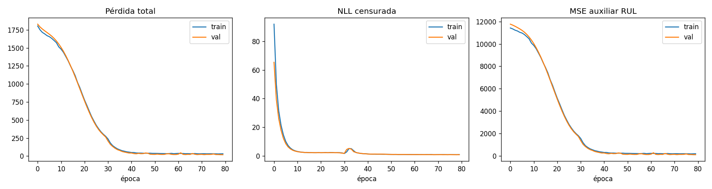
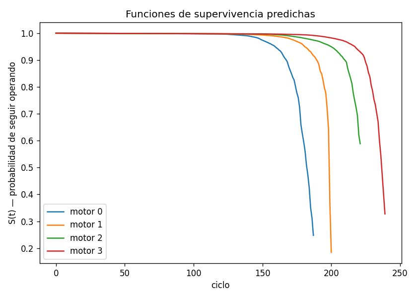
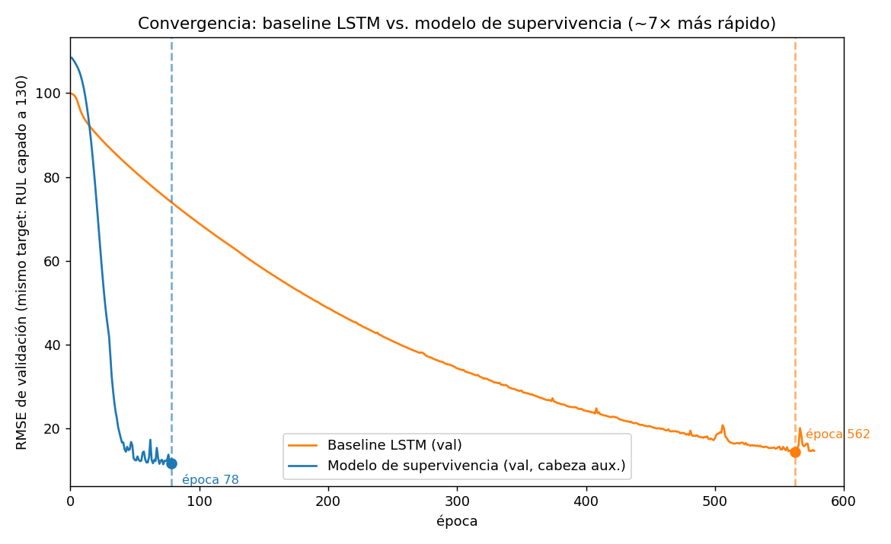

# Predicción de vida útil restante (RUL) como análisis de supervivencia censurada

Predicción de vida útil restante (RUL) en motores turbofán (NASA C-MAPSS,
subconjunto FD001), reformulada como un problema de **análisis de
supervivencia con censura por la derecha** en vez de regresión directa —
con un encoder causal de atención en dos etapas diseñado desde cero para
este problema.

## Por qué supervivencia, no regresión directa

El enfoque estándar en la literatura de C-MAPSS trata esto como regresión:
dado el historial de sensores, predecir un número de RUL. Ese enfoque
ignora algo que está justo en la estructura del propio dataset: el set de
test de C-MAPSS trunca cada motor *antes* de que falle — es censura por
la derecha en el sentido estricto del término. Casi ningún proyecto
público sobre este dataset modela esa censura explícitamente; la mayoría
la ignora y entrena solo con trayectorias completas.

Este proyecto reformula el problema en tiempo discreto: en cada ciclo, el
modelo estima una tasa de riesgo (hazard) — la probabilidad de fallar en
ese ciclo específico, dado que el motor ha sobrevivido hasta ahí. La
función de supervivencia se deriva de esa tasa por construcción
matemática (producto acumulado de "no falló"), y el entrenamiento usa una
verosimilitud censurada que aprovecha tanto los motores que sí fallaron
en los datos como los que fueron cortados artificialmente antes.

## El dataset

NASA C-MAPSS, subconjunto FD001: 100 motores de entrenamiento (vida
completa hasta el fallo), 100 motores de test (truncados, con el RUL
verdadero en el punto de corte dado por separado). Cada fila es un ciclo
operativo con 21 sensores + 3 ajustes operacionales; se descartan 7
sensores casi constantes (documentados en la literatura) y los ajustes
operacionales (FD001 es de una sola condición), quedando 14 features.

## Arquitectura

Un encoder causal de atención en **dos etapas**, diseñado a medida en vez
de usar LSTM o un Transformer estándar:

- **Etapa 1 — atención causal en el tiempo, por sensor.** Cada canal de
  sensor atiende a su propia historia, con máscara causal estricta (nunca
  ve el futuro).
- **Etapa 2 — atención entre sensores, dentro de cada ciclo.** Mezcla
  información entre los 14 sensores en el mismo instante, sin cruzar
  nunca el tiempo — por eso es causal "gratis", sin necesitar máscara.

La idea está inspirada en la atención cruzada tiempo/dimensión de
Crossformer, pero simplificada y hecha estrictamente causal (Crossformer
estándar no lo es). Se verificó la causalidad con un test explícito:
modificar un ciclo futuro no cambia la salida en ciclos anteriores
(diferencia numérica exactamente 0.0).

**Salidas (multitask mínimo):** una hazard head (la salida principal, de
la que se deriva todo lo demás) y una cabeza auxiliar de regresión
directa de RUL (peso bajo en la pérdida, 0.15) — usada como comparación
interna, no como el objetivo principal.

## Hallazgo de arquitectura: menos capas, mejor generalización

Una búsqueda de hiperparámetros contra el set de validación mostró que
`n_layers=1` supera claramente a 2 o 3 capas (val_nll de 1.58 vs ~2.39)
con este dataset. Con solo 80 motores de entrenamiento, más capas de
atención le dan al modelo más capacidad de la que el dataset puede
sostener sin sobreajustar. El ancho (`d_model`) resultó casi irrelevante
(16, 32 y 64 dieron resultados prácticamente idénticos).

## Resultados finales





| Métrica | Baseline LSTM (convergido, 562 épocas) | Modelo de supervivencia (~78 épocas) |
|---|---|---|
| RMSE | 14.99 | **14.78** |
| MAE | 11.30 | **10.77** |
| C-index | 0.860 | **0.875** |
| median_life_rmse | — (no aplica) | 29.19 |

**Sobre esta comparación, con honestidad:** un LSTM simple, entrenado
hasta converger de verdad, queda prácticamente empatado con el modelo de
supervivencia en precisión pura. La primera comparación (con el baseline
entrenado solo 100 épocas) sugería una ventaja mucho más grande — pero
era un artefacto de un baseline sin converger, no una diferencia real. La
ventaja genuina y medible del modelo de supervivencia no es la precisión
puntual, es:

1. **Convergencia ~7× más rápida** (78 épocas vs 562) — probablemente por
   el `LayerNorm` en cada etapa del encoder, ausente en el LSTM simple.
2. **C-index ligeramente mejor** (0.875 vs 0.860) — la métrica que
   específicamente evalúa qué tan bien se ordena el riesgo relativo,
   central al enfoque de supervivencia.
3. **El modelo entrega una función de supervivencia completa por motor**
   (con incertidumbre), no un número — algo que un LSTM de regresión
   simplemente no puede producir, sin importar cuánto se entrene.

## Proceso de depuración (lo que realmente pasó, no la versión pulida)

- **Problema de memoria real (día 4):** la etapa 1 del encoder escala
  como `O(batch × sensores × T²)`; con motores de hasta 362 ciclos, una
  sola matriz de atención pesaba ~0.47 GB, suficiente para tumbar el
  proceso en CPU. Se intentó el arreglo "correcto" (kernels de atención
  eficientes en memoria de PyTorch) y no ayudó: esos kernels solo
  aceleran con GPU, y el entorno de desarrollo era CPU pura. El arreglo
  real fue bajar el batch size.
- **Bug real en el C-index:** la primera versión marcaba el test como
  "censurado" para el cálculo del C-index, dando `nan` (sin pares
  comparables). El RUL de test sí se conoce (viene en `RUL_FD001.txt`);
  la censura solo aplica a lo que el modelo ve como entrada, no a lo que
  se sabe como evaluador.
- **La extrapolación de vida mediana falló al principio** (RMSE=65) por
  extrapolar tendencias sobre hazards casi nulos y planos (motores
  sanos), con un horizonte máximo (200) que no coincidía con el tope del
  RUL real (130). Arreglar el tope y añadir un fallback cuando la
  tendencia no es confiable bajó el error a 44 — pero eso rompió el
  C-index (0.875 → 0.68) al colapsar muchos motores sanos al mismo valor
  (empates). La solución fue separar las dos preguntas: el C-index usa el
  hazard crudo (continuo) como score de riesgo, la vida mediana capada se
  usa solo para el RMSE puntual. Una búsqueda posterior de umbrales
  contra validación bajó el error final a 29.
- **El baseline "ganaba" al principio (día 6)** simplemente porque se le
  dio muy pocas épocas — un LSTM sin `LayerNorm` converge mucho más
  lento de lo esperado (562 épocas reales, no las 15-100 iniciales).

## Limitaciones conocidas (aceptadas deliberadamente)

- **El encoder no tiene ventana de contexto acotada.** Cada `h(t)`
  atiende a todo el historial desde el ciclo 1; la memoria escala como
  `O(T²)`. Válido para el rango de FD001 (hasta 362 ciclos), no escala de
  forma segura a secuencias arbitrariamente largas sin modificación. El
  arreglo real (atención con ventana deslizante acotada) queda pendiente
  para una v2.0.
- **La extrapolación de vida mediana es una heurística**, no una segunda
  cabeza de pronóstico entrenada — necesaria porque en el punto de corte
  no hay sensores futuros con los que calcular hazards reales. Mejoró
  bastante con ajuste de umbrales, pero sigue siendo la pieza más floja
  del proyecto comparada con la cabeza auxiliar de RUL directa.
- **Solo se evaluó FD001**, el más simple de los cuatro subconjuntos de
  C-MAPSS (una condición operacional, un modo de falla). FD002 y FD004
  (múltiples condiciones operacionales) y FD003 (dos modos de falla) no
  se tocaron — fue una decisión consciente por el plazo del proyecto, no
  una limitación técnica del enfoque en sí. La arquitectura y la
  formulación de supervivencia deberían extenderse sin cambios
  conceptuales a los otros subconjuntos, pero eso no se verificó.

## Estructura del código

```
preprocess.py         # carga, normalización, split train/val por motor, censura simulada
model.py               # encoder causal de dos etapas + hazard head + RUL head + verosimilitud
metrics.py              # RMSE/MAE, C-index, extrapolación, guardado de historial, gráficas
train.py                 # orquestador: entrena con early stopping, evalúa, guarda todo
baseline.py              # LSTM de regresión directa (punto de comparación)
search_hparams.py         # búsqueda de d_model / n_layers / lr contra validación
tune_extrapolation.py      # búsqueda de umbrales de la heurística de extrapolación
```

## Cómo reproducir

Pensado para correr en Google Colab con GPU (en CPU, ver la nota de
memoria arriba — batch_size más chico y tiempos de entrenamiento mucho
más largos).

```bash
python search_hparams.py --data_dir data --epochs 40 --patience 8
python train.py --data_dir data --d_model 32 --n_layers 1 --lr 1e-3 --epochs 80 --patience 10
python tune_extrapolation.py --data_dir data --model_path model.pt --d_model 32 --n_layers 1
```
